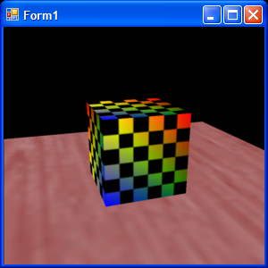
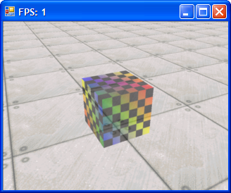

# gfx-sandbox
Sandbox for me to learn various graphics frameworks.

1. [Rasterizer (2008)](#1-rasterizer-2008): Soft 3D rasterizer
2. [React threejs](#2-react-threejs): three.js app with react, fiber, and drei
3. [GLWinFF](#3-glwinff): OpenGL fixed-function and WinAPI
4. [webgl-react](#4-webgl): WebGL/react
5. [webgpu-react](#5-webgpu): WebGPU/react
6. [metal-triangle](#6-metal): Metal (Xcode)

## 1. Rasterizer (2008)
A software 3D graphics rasterizer from scratch. Converted to VS 2022 project. Runs on Windows.

Rendering code: [Rasterizer/MainForm.cs](Rasterizer/Rasterizer/MainForm.cs)

Math helpers: [Rasterizer/Math3D.cs](Rasterizer/Rasterizer/Math3D.cs)

 

Duplicated here from [github.com/joshwyant/rasterizer](https://github.com/joshwyant/rasterizer).

## 2. React three.js
Using three.js with react (vite), react/three-fiber, and react/three-drei, to easily add meshes to the React DOM and use orbit controls.

Use:
```bash
cd threejs/
npm run dev
```

Then open [http://localhost:5173/](http://localhost:5173/).

## 3. GLWinFF
Old-style OpenGL fixed-function pipeline using the Windows API.

Main GL code is in [GLWinFF.cpp](GLWinFF/GLWinFF/GLWinFF.cpp) `RenderWindow()`.

## 4. WebGL
WebGL in a react project.

Use:
```bash
cd webgl-react/
npm run dev
```

Then open [http://localhost:5173/](http://localhost:5173/).

## 5. WebGPU
WebGPU in a react project.

Use:
```bash
cd webgpu-react/
npm run dev
```

Then open [http://localhost:5173/](http://localhost:5173/).

## 6. Metal
Xcode project with Metal. Run in Xcode on a Mac.
